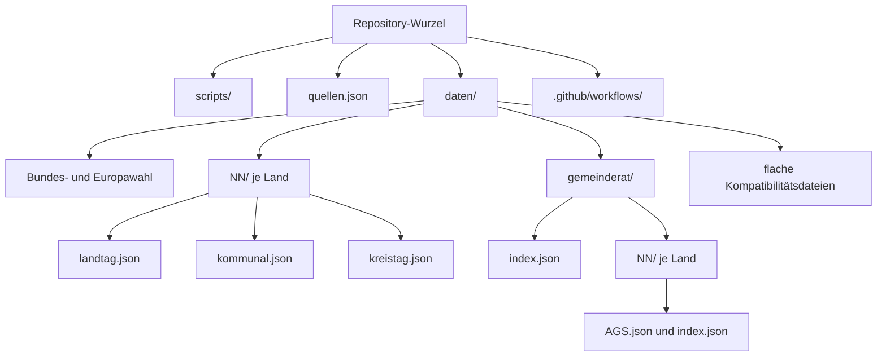
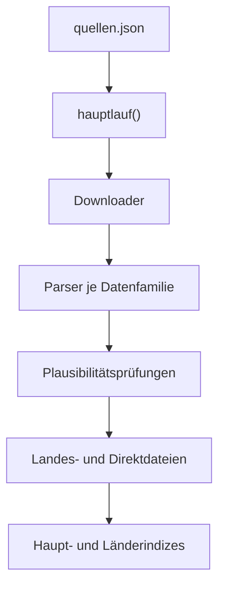

# Projektkontext für KI-Assistenten

Diese Datei ist der technische Einstiegspunkt für KI-Assistenten und neue Entwickler. Sie erklärt,
wie der Wahldaten-Sammler arbeitet, welche Invarianten nicht unbeabsichtigt geändert werden dürfen
und wie die erzeugten Dateien zusammenhängen. Die kürzere Benutzerdokumentation steht in der
[`README.md`](README.md); Quellen- und Lizenzdetails stehen in
[`LIZENZ-DATEN.md`](LIZENZ-DATEN.md).

> **Wichtige Begriffsklärung:** `gemeinderat` ist im Dateisystem der gemeinsame technische Begriff
> für Gemeinde- **und** Stadtratswahlen. Eine Stadt bekommt keine zweite Stadtratsdatei und es gibt
> keinen separaten `stadtrat`-Ordner. Im JSON bleibt die interne Wahlart aus historischen Gründen
> `kommunal`.

> **Kritische Datenqualitätswarnung:** GERDAs kommunaler Datensatz `municipal_harm_25.csv` bildet
> nicht alle Parteien, Wählervereinigungen und örtlichen Listen einzeln ab. Er fasst solche
> Wahlvorschläge ohne ihren Namen in `other` zusammen; der Sammler gibt dieses Feld als `Sonstige`
> aus. Für die beabsichtigte vollständige Anzeige der Gemeinderats- und Stadtratswahl sind die
> daraus erzeugten GERDA-Daten deshalb **unbrauchbar**. Die vorhandenen `kommunal.json`- und
> `gemeinderat/...`-Dateien dürfen nicht als vollständige Parteien- oder Listenresultate behandelt
> werden. Details und ein belegtes Beispiel stehen unter
> [Bekannte Datenlücke: GERDA-Gemeinderatsdaten](#bekannte-datenlücke-gerda-gemeinderatsdaten).

## Inhaltsverzeichnis

- [Ziel und Systemgrenzen](#ziel-und-systemgrenzen)
- [Bekannte Datenlücke: GERDA-Gemeinderatsdaten](#bekannte-datenlücke-gerda-gemeinderatsdaten)
- [Orientierung im Repository](#orientierung-im-repository)
- [Ordner- und Dateistruktur](#ordner--und-dateistruktur)
- [Datenfluss](#datenfluss)
- [Quellenkonfiguration](#quellenkonfiguration)
- [Sammler im Detail](#sammler-im-detail)
- [Ausgabeformate](#ausgabeformate)
- [Schlüssel und Namenskonventionen](#schlüssel-und-namenskonventionen)
- [Idempotenz und Aktualisierungsregeln](#idempotenz-und-aktualisierungsregeln)
- [Fehlerbehandlung und Plausibilitätsprüfungen](#fehlerbehandlung-und-plausibilitätsprüfungen)
- [Kommandozeile](#kommandozeile)
- [GitHub Actions](#github-actions)
- [Selbsttests](#selbsttests)
- [Typische Änderungen](#typische-änderungen)
- [Prüfliste vor einem Merge](#prüfliste-vor-einem-merge)

## Ziel und Systemgrenzen

Das Repository stellt kompakte, statische Wahlergebnis-Assets für Plakat Kompass beziehungsweise
Plakat Radar bereit. Der zentrale Sammler ist
[`scripts/sammeln.py`](scripts/sammeln.py). Er lädt öffentliche Quelldateien, validiert und
normalisiert sie und schreibt JSON unter [`daten/`](daten/).

Die wichtigsten Architekturentscheidungen sind:

1. **Kein GENESIS:** Der reguläre Datenfluss benötigt keine Anmeldung, Secrets oder persönliche
   Zugangsdaten. Siehe auch [Warum GERDA](README.md#warum-gerda).
2. **Rohdaten nur temporär:** CSV- und XLSX-Quelldateien werden in einem temporären Verzeichnis
   verarbeitet und danach verworfen. Im Repository liegen ausschließlich die erzeugten App-JSONs.
   Eine dokumentierte Ausnahme: Lässt sich eine amtliche Quelle nicht mit der
   Python-Standardbibliothek zuverlässig auslesen (z. B. eine PDF- oder XLSX-Tabelle), liegt das
   Ergebnis einer einmaligen, geprüften Handextraktion als Snapshot unter [`quellen/`](quellen/) –
   siehe `_snapshot_gebiete` in `scripts/sammeln.py` und [`LIZENZ-DATEN.md`](LIZENZ-DATEN.md).
3. **Ein Download je Datensatz und Lauf:** Eine GERDA-Datei wird einmal geladen und anschließend für
   alle angeforderten Länder ausgewertet.
4. **Aktuelle Join-Schlüssel:** Die harmonisierten GERDA-Dateien bilden Gemeindeergebnisse auf den
   AGS-Stand 2025 ab. Das ist der Join-Schlüssel der App, nicht zwingend der historische
   Gebietsstand am Wahltag.
5. **Kleine Direktabrufe:** Für jede Gemeinde gibt es genau eine Datei nach dem Muster
   `daten/gemeinderat/{land}/{ags}.json`.
6. **Reproduzierbare Ausgaben:** Ein Laufdatum allein ändert keine Datei. Nur fachliche Änderungen
   erzeugen einen neuen Git-Diff.
7. **Quelle und Lizenz reisen mit:** Jede Ergebnisdatei enthält Quellen-, Lizenz- und
   Datenstandsangaben. Siehe [`LIZENZ-DATEN.md`](LIZENZ-DATEN.md).

Die aktuell erzeugten 8.433 Gemeindedateien und 294 Landkreise sind ein **Datenstand**, keine für
alle Zukunft festcodierte Sollzahl. Harte Strukturregeln wie 16 Landkennzahlen, achtstellige AGS und
der Ausschluss kreisfreier Städte aus Kreistagsdateien sind dagegen Invarianten.

## Bekannte Datenlücke: GERDA-Gemeinderatsdaten

Die technische Aufteilung in kleine Gemeindedateien funktioniert, aber ihre derzeitige kommunale
Quelle ist für den fachlichen Zweck nicht ausreichend. GERDAs `municipal_harm_25.csv` besitzt nur
Spalten für eine feste Auswahl bundesweit wiederkehrender Parteien sowie das Sammelfeld `other`.
Örtliche Wählervereinigungen, freie Listen und andere Wahlvorschläge bleiben darin nicht unter ihrem
wirklichen Namen erhalten. Diese Information kann der Sammler nachträglich nicht wiederherstellen.

Ein nachprüfbares Beispiel ist Neuhausen/Erzgeb. (`AGS 14522400`):

- Das [amtliche Ergebnis des Freistaats Sachsen](https://wahlen.sachsen.de/gemeinderatswahlen-2024-wahlergebnisse.php?detailed=true&landkreis=14522)
  weist `WV` mit 66,5 Prozent, CDU mit 18,4 Prozent und AfD mit 15,1 Prozent aus.
- Die [Gemeinde Neuhausen](https://neuhausen.de/gemeinderat/) nennt die örtliche Gruppe
  „Freie Wählergemeinschaft Jugend und Sport“.
- GERDA speichert die 66,5 Prozent nur als `other = 0.665`. Der aktuelle Parser übersetzt `other`
  regelkonform zu `Sonstige`; deshalb zeigt
  [`daten/gemeinderat/14/14522400.json`](daten/gemeinderat/14/14522400.json) fälschlich den Eindruck
  einer echten Ergebnisgruppe `Sonstige`, obwohl dahinter eine benennbare Wählervereinigung steht.

Das ist kein Rundungs- oder Rechenfehler im Sammler, sondern ein bereits in der Quelle eingetretener
Informationsverlust. Daraus folgen diese verbindlichen Grenzen:

1. Die derzeitigen GERDA-Ausgaben unter `daten/NN/kommunal.json` und `daten/gemeinderat/NN/` sind
   **nicht produktionsgeeignet**, wenn die App alle angetretenen Parteien und Listen korrekt nennen
   soll.
2. Sie dürfen nicht für vollständige Listenvergleiche, Rankings oder Aussagen über einzelne
   örtliche Wahlvorschläge verwendet werden.
3. Allenfalls eine ausdrücklich als grob gekennzeichnete Zusammenfassung „bekannte überregionale
   Parteien gegenüber nicht aufgeschlüsseltem Rest“ wäre fachlich vertretbar. Das ist nicht das
   Ziel der geplanten Gemeinderatsanzeige.
4. Für eine belastbare Gemeinderats- und Stadtratsfunktion müssen die amtlichen Ergebnisquellen der
   16 Länder erschlossen werden. Die landesspezifischen Parser müssen die originalen Partei-,
   Listen- und Wählervereinigungsnamen erhalten und je Gemeinde nach AGS in das gemeinsame
   Ausgabeformat überführen.

Die Warnung betrifft ausdrücklich die kommunale GERDA-Datei `municipal_harm_25.csv` und ihre daraus
erzeugten Gemeinderats-/Stadtrats-Assets. Sie erklärt nicht automatisch andere Datenfamilien wie
Landtags- oder Kreistagswahlen für unbrauchbar; diese müssen jeweils anhand ihres eigenen Schemas
und des gewünschten App-Zwecks bewertet werden.

## Orientierung im Repository

| Pfad | Aufgabe | Wichtige Querverweise |
|---|---|---|
| [`scripts/sammeln.py`](scripts/sammeln.py) | Downloader, Parser, Validierung, Schreiber und CLI | [`hauptlauf()`](scripts/sammeln.py#L1448-L1511), [`main()`](scripts/sammeln.py#L1514-L1547) |
| [`scripts/selbsttest.py`](scripts/selbsttest.py) | Netzfreie Parser- und Schreibtests | [Testübersicht](#selbsttests) |
| [`quellen.json`](quellen.json) | URLs, Datensätze, Länder und amtliche Ergänzungen | [Quellenkonfiguration](#quellenkonfiguration) |
| [`daten/index.json`](daten/index.json) | Maschinenlesbarer Hauptindex aller Wahlarten | [Indexstruktur](#indexstruktur) |
| [`daten/gemeinderat/index.json`](daten/gemeinderat/index.json) | Gesamtindex der Gemeindedirektdateien | [Direkter Gemeindeabruf](#direkter-gemeindeabruf) |
| [`daten/LIESMICH.md`](daten/LIESMICH.md) | Kurzer Hinweis direkt im Ausgabeordner | [`README.md`](README.md#ausgabe) |
| [`.github/workflows/sammeln.yml`](.github/workflows/sammeln.yml) | Manueller und monatlicher Live-Abruf | [GitHub Actions](#github-actions) |
| [`.github/workflows/selbsttest.yml`](.github/workflows/selbsttest.yml) | Netzfreie CI bei Code- und PR-Änderungen | [Selbsttests](#selbsttests) |
| [`LIZENZ-DATEN.md`](LIZENZ-DATEN.md) | Attribution und Lizenz je Datenfamilie | [`LICENSE`](LICENSE) für den Code |

Der Sammler verwendet nur die Python-Standardbibliothek. Es gibt bewusst keine
`requirements.txt`, kein `pip install` und keine Laufzeitabhängigkeit von Pandas oder openpyxl.

## Ordner- und Dateistruktur



### Kanonische Dateien

| Muster | Ebene | Anzahl/Verfügbarkeit | Beispiel |
|---|---|---|---|
| `daten/bundestagswahl-2025.json` | Bundestagswahlkreis | eine Datei | [`bundestagswahl-2025.json`](daten/bundestagswahl-2025.json) |
| `daten/europawahl-2024.json` | Kreis | eine Datei | [`europawahl-2024.json`](daten/europawahl-2024.json) |
| `daten/NN/landtag.json` | Gemeinden eines Landes | 16 Länder | [`daten/14/landtag.json`](daten/14/landtag.json) |
| `daten/NN/kommunal.json` | Gemeinde-/Stadtratswahl eines Landes | 16 Länder | [`daten/14/kommunal.json`](daten/14/kommunal.json) |
| `daten/NN/kreistag.json` | echte Landkreise eines Landes | 13 Flächenländer | [`daten/14/kreistag.json`](daten/14/kreistag.json) |
| `daten/gemeinderat/NN/AGS.json` | genau eine Gemeinde oder Stadt | derzeit 10.714 Dateien | [`14730110.json`](daten/gemeinderat/14/14730110.json) |
| `daten/gemeinderat/NN/index.json` | Direktdatei-Metadaten eines Landes | 16 Länder | [`daten/gemeinderat/14/index.json`](daten/gemeinderat/14/index.json) |

`NN` ist immer die zweistellige Landkennzahl aus [`quellen.json`](quellen.json), beispielsweise
`14` für Sachsen. `AGS` ist immer der vollständige achtstellige Gemeindeschlüssel.

### Kompatibilitätsdateien

Für ältere Verbraucher existieren weiterhin flache, bytegleiche Kopien:

| Kanonisch | Kompatibilität | Beispiel |
|---|---|---|
| `daten/NN/landtag.json` | `daten/land-NN.json` | [`daten/land-14.json`](daten/land-14.json) |
| `daten/NN/kommunal.json` | `daten/kommunal-NN.json` | [`daten/kommunal-14.json`](daten/kommunal-14.json) |
| `daten/NN/kreistag.json` | `daten/kreistag-NN.json` | [`daten/kreistag-14.json`](daten/kreistag-14.json) |

Die Zuordnung entsteht in
[`_ausgabepfade()`](scripts/sammeln.py#L1069-L1078), die Bytegleichheit in
[`_mehrfach_schreiben()`](scripts/sammeln.py#L1081-L1109). Neue App-Funktionen sollen die
kanonischen Ordnerpfade verwenden; die flachen Dateien sind nur ein Übergangsschutz.

## Datenfluss



1. [`main()`](scripts/sammeln.py#L1514-L1547) prüft die CLI-Argumente und normalisiert eine
   einstellige Landangabe auf zwei Stellen.
2. [`hauptlauf()`](scripts/sammeln.py#L1448-L1511) lädt
   [`quellen.json`](quellen.json), bestimmt die auszuführenden Datenfamilien und sammelt Fehler.
3. [`lade_datei()`](scripts/sammeln.py#L80-L117) lädt öffentliche Dateien mit Timeout,
   Wiederholungen und Git-LFS-Zeigerprüfung.
4. Die Parser wählen je Land das jüngste verfügbare Wahljahr, prüfen Schlüssel und normalisieren
   Anteile. Siehe [Sammler im Detail](#sammler-im-detail).
5. Die Schreiber erzeugen kanonische Dateien, Kompatibilitätskopien und kleine AGS-Dateien.
6. [`_index_schreiben()`](scripts/sammeln.py#L1313-L1415) baut zuletzt die Indizes aus den
   tatsächlich vorhandenen Dateien neu auf.
7. [`_uebersicht_fuer_github()`](scripts/sammeln.py#L1418-L1445) schreibt bei GitHub Actions eine
   kompakte Zusammenfassung in `GITHUB_STEP_SUMMARY`.

## Quellenkonfiguration

[`quellen.json`](quellen.json) ist die einzige Quelle für URLs, Ländernamen, Wahlbezeichnungen und
amtliche Ergänzungen. Netzwerkadressen gehören nicht verteilt in den Parsercode.

| Konfigurationspfad | Quelldatei | Parser | Ausgabe |
|---|---|---|---|
| `bund[]` Bundestagswahl | kerg2 der Bundeswahlleiterin | [`kerg2_auswerten()`](scripts/sammeln.py#L854-L914) | [`daten/bundestagswahl-2025.json`](daten/bundestagswahl-2025.json) |
| `bund[]` Europawahl | kerg2 der Bundeswahlleiterin | [`kerg2_auswerten()`](scripts/sammeln.py#L854-L914) | [`daten/europawahl-2024.json`](daten/europawahl-2024.json) |
| `gerda.datasets.landtag` | `state_harm_25.csv` | [`gerda_datei_auswerten()`](scripts/sammeln.py#L360-L388) | `daten/NN/landtag.json` |
| `gerda.datasets.kommunal` | `municipal_harm_25.csv` | [`gerda_kommunal_auswerten()`](scripts/sammeln.py#L434-L508) | `daten/NN/kommunal.json` und Direktdateien |
| `gerda.datasets.kreistag` | `county_elec_harm_21_cty.csv` | [`gerda_kreistag_auswerten()`](scripts/sammeln.py#L612-L667) | `daten/NN/kreistag.json` |
| `gerda.datasets.kreistag.kreisverzeichnis_url` | `county_council_seats.csv` | [`gerda_kreisverzeichnis_auswerten()`](scripts/sammeln.py#L511-L532) | nur als Join und Vollständigkeitsreferenz |
| `ergaenzungen[]` für Land `07` | amtliche RLP-XLSX 2026 | [`rlp_xlsx_auswerten()`](scripts/sammeln.py#L847-L861) | ersetzt GERDA-Landtagsdaten für RLP |
| `ergaenzungen[]` für Land `14` | amtliche Sachsen-XLSX 2024, Blatt `LW24_endgErgebnisse_GE&TG` | [`sachsen_xlsx_auswerten()`](scripts/sammeln.py#L975-L993) | ersetzt GERDA-Landtagsdaten für Sachsen |

[`_gerda_quelle()`](scripts/sammeln.py#L1126-L1133) verbindet die gemeinsamen GERDA-Angaben
(`quelle`, Lizenz, Zitation und Quellenseite) mit genau einem Datensatz. Die daraus entstandenen
Metadaten werden über [`_quellenfelder()`](scripts/sammeln.py#L1106-L1123) in jede Ausgabedatei
kopiert. [`ERGAENZUNGS_PARSER`](scripts/sammeln.py#L1135-L1140) bildet den `parser`-Namen aus
`quellen.json` auf die passende Auswertefunktion ab; ein unbekannter Name schlägt laut fehl.

Chemnitz, Dresden, Leipzig und Zwickau liefert Sachsens amtliche Datei ausschließlich als mehrere
Teilgemeinde-Zeilen ohne eine zusammenfassende Gemeindezeile.
[`sachsen_zeilen_auswerten()`](scripts/sammeln.py#L928-L963) summiert deren Listenstimmen,
Wahlberechtigte und Wähler zu genau einem Ergebnis je achtstelligem Gemeinde-AGS; welche vier
Städte das betrifft, steht fest in
[`SACHSEN_NUR_TEILGEMEINDEN`](scripts/sammeln.py#L900-L907). Taucht eine unbekannte Stadt nur als
Teilgemeinde auf oder fehlt einer der vier bekannten Städte, bricht der Sammler ab, statt still ein
unvollständiges Ergebnis zu schreiben.

**Hinweis zur Zeilennummerierung:** Die `#L`-Anker in diesem Abschnitt sind mit dem Stand nach der
Sachsen-Ergänzung aktuell. Ältere Anker in anderen Abschnitten dieser Datei können durch diese
Änderung um denselben Betrag verschoben sein; bei Bedarf über die Funktionsnamen statt der
Zeilennummern suchen.

## Sammler im Detail

### Netzwerk und temporäre Dateien

[`lade_datei()`](scripts/sammeln.py#L80-L117):

- sendet nur einen festen `User-Agent`, keine Cookies oder Zugangsdaten;
- verwendet 300 Sekunden Timeout und bis zu drei Versuche;
- wiederholt nur typische temporäre HTTP-Fehler (`429`, `500`, `502`, `503`, `504`);
- respektiert `Retry-After`, sofern vorhanden;
- lehnt leere Dateien und versehentlich geladene Git-LFS-Zeiger ab.

[`hole_roh()`](scripts/sammeln.py#L120-L126) ist der Textdatei-Helfer für kerg2. Die großen GERDA-
und RLP-Dateien werden in [`_laender_holen()`](scripts/sammeln.py#L977-L1019) beziehungsweise
[`_kommunal_holen()`](scripts/sammeln.py#L1022-L1066) innerhalb eines
`TemporaryDirectory` verarbeitet. Nach dem Funktionsende löscht Python diesen Ordner automatisch.

### Bundestags- und Europawahl

[`eine_bundeswahl()`](scripts/sammeln.py#L917-L941) liest die Einträge aus `bund[]` in
[`quellen.json`](quellen.json). [`kerg2_auswerten()`](scripts/sammeln.py#L854-L914):

- sucht die echte kerg2-Kopfzeile hinter den beschreibenden Anfangszeilen;
- filtert exakt auf die konfigurierte Gebietsebene;
- verwendet bei der Bundestagswahl nur Stimme `2` (Zweitstimme);
- bewahrt führende Nullen in Gebietsschlüsseln;
- übernimmt Wahlbeteiligung aus der Systemgruppe `Wählende`;
- verlangt mindestens drei Parteien und eine plausible Anteilssumme zwischen 95 und 105 Prozent.

### Landtagswahlen aus GERDA

[`_laender_holen()`](scripts/sammeln.py#L977-L1019) lädt `state_harm_25.csv` einmal. Der Parser
[`gerda_datei_auswerten()`](scripts/sammeln.py#L360-L388) arbeitet zweiphasig:

1. [`_gerda_letzte_jahre_und_namen()`](scripts/sammeln.py#L295-L312) bestimmt das jüngste Jahr je
   angefordertem Land und sammelt Namen als Fallback.
2. Der zweite Durchlauf übernimmt nur Zeilen dieses Jahres und baut `gebiete` nach AGS auf.

[`_gerda_parteispalten()`](scripts/sammeln.py#L282-L292) grenzt echte Parteispalten von abgeleiteten
GERDA-Analysefeldern wie `far_right` ab. [`_gerda_gebiet()`](scripts/sammeln.py#L315-L357) verlangt
achtstellige AGS, mindestens drei Parteien und eine Rohsumme zwischen `0.95` und `1.05`. Zulässige
Anteile werden auf 100 Prozent normiert und auf eine Nachkommastelle gerundet.

### Amtliche RLP-Ergänzung 2026

Rheinland-Pfalz ist für die Landtagswahl eine bewusst konfigurierte Ausnahme unter
`ergaenzungen[]` in [`quellen.json`](quellen.json). Die amtliche XLSX ersetzt nach dem GERDA-Lauf
das Land `07`; Kommunal- und Kreistagsdaten sind davon nicht betroffen.

- [`_xlsx_zeilen()`](scripts/sammeln.py#L687-L723) liest die XLSX als ZIP/XML ohne Fremdpaket.
- [`rlp_xlsx_auswerten()`](scripts/sammeln.py#L820-L836) prüft Kopfzeile und Parteispalten.
- [`rlp_zeilen_auswerten()`](scripts/sammeln.py#L779-L817) erwartet ungefähr 2.300 eindeutige
  Gemeindezeilen.
- [`_rlp_gebiet()`](scripts/sammeln.py#L756-L776) verlangt, dass die Summe aller Parteistimmen
  exakt der Zahl gültiger Landesstimmen entspricht.
- Gemeinden ohne getrenntes Ergebnis erhalten das Ergebnis des amtlichen Zusammenlegungsziels
  sowie `hinweis` und `zusammengelegt_mit`. Ein Beispiel steht in
  [README – Rheinland-Pfalz 2026](README.md#rheinland-pfalz-2026).

### Gemeinde- und Stadtratswahlen

[`_kommunal_holen()`](scripts/sammeln.py#L1022-L1066) lädt `municipal_harm_25.csv` einmal für alle
angeforderten Länder. [`gerda_kommunal_auswerten()`](scripts/sammeln.py#L434-L508):

- prüft das erwartete GERDA-Schema;
- wählt mit [`_neueste_gerda_jahre()`](scripts/sammeln.py#L419-L431) das jüngste Wahljahr je Land;
- verlangt einen achtstelligen AGS, dessen erste zwei Stellen zum Land passen;
- behandelt `cdu_csu` in Bayern als CSU, sonst als CDU;
- übernimmt die zehn konfigurierten Parteigruppen aus
  [`KOMMUNAL_PARTEISPALETEN`](scripts/sammeln.py#L188-L200);
- normalisiert die Summe über [`_anteile_in_prozent()`](scripts/sammeln.py#L400-L411);
- ordnet GERDAs Sammelfeld `other` der Ausgabegruppe `Sonstige` zu;
- verbietet doppelte AGS und widersprüchliche Wahltage innerhalb eines Landesjahres.

Die Begriffe Gemeinde- und Stadtratswahl bezeichnen hier dieselbe Datenfamilie. Beide landen in
`kommunal.json` und anschließend unter `gemeinderat/`; es gibt keine zweite Kopie für Städte.

Diese Verarbeitung ist technisch deterministisch, aber fachlich verlustbehaftet: `other` kann
örtliche Listen, Wählervereinigungen und andere Wahlvorschläge enthalten, deren Namen GERDA nicht
überliefert. Auch eine Mehrheitsgruppe kann dadurch nur als `Sonstige` erscheinen. Für eine
vollständige Parteien- und Listenanzeige ist diese Quelle daher unbrauchbar; siehe
[Bekannte Datenlücke: GERDA-Gemeinderatsdaten](#bekannte-datenlücke-gerda-gemeinderatsdaten).

### Kreistagswahlen

Kreistagsdaten benötigen zwei Downloads:

1. `county_elec_harm_21_cty.csv` enthält die Wahlergebnisse.
2. `county_council_seats.csv` liefert aktuelle Kreisnamen, Land und Gebietstyp.

[`gerda_kreisverzeichnis_auswerten()`](scripts/sammeln.py#L511-L532) wählt den neuesten
Verzeichniseintrag je fünfstelligem Kreisschlüssel. Nur `Landkreis` und `kreisfreie Stadt` sind
zulässige Typen. [`gerda_kreistag_auswerten()`](scripts/sammeln.py#L612-L667) lässt kreisfreie
Städte ausdrücklich aus und vergleicht am Ende die Ergebnismenge exakt mit allen aktuellen
Landkreisen des Verzeichnisses.

[`_kreistag_gebiet()`](scripts/sammeln.py#L567-L609) prüft die gemeldete Spaltensumme, ordnet
wiederkehrende Parteien und Gruppen über
[`KREISTAG_GRUPPEN`](scripts/sammeln.py#L220-L243) zu und bewahrt alle nicht einzeln abgebildeten
örtlichen Listen als `Sonstige`. Bayern verwendet CSU, die übrigen Länder CDU.

Berlin (`11`), Bremen (`04`) und Hamburg (`02`) besitzen keine Landkreise. Daher gibt es für sie
bewusst keine `kreistag.json`; [`hauptlauf()`](scripts/sammeln.py#L1481-L1503) wertet das nicht als
Fehler.

### Schreiben der Landesdateien

[`_land_schreiben()`](scripts/sammeln.py#L1227-L1247) baut die Landtagsdateien.
[`_gebietswahl_schreiben()`](scripts/sammeln.py#L1250-L1295) baut Kommunal- und Kreistagsdateien.
Beide verwenden:

- [`_ausgabepfade()`](scripts/sammeln.py#L1069-L1078) für kanonischen Pfad und Alias;
- [`_neuerer_bestand_spiegeln()`](scripts/sammeln.py#L1203-L1224) als Schutz vor einem Rückschritt
  auf ein älteres Wahljahr;
- [`_mehrfach_schreiben()`](scripts/sammeln.py#L1081-L1109) für bytegleiche Kopien.

Nach einer Kommunaldatei erzeugt
[`_gemeinderatsdateien_schreiben()`](scripts/sammeln.py#L1112-L1200) genau eine Direktdatei je AGS.
Die Funktion prüft Land, Wahlart, Schlüsselart und AGS-Präfix, übernimmt denselben `stand` wie die
Landesdatei und löscht ausschließlich veraltete Dateien, deren Name exakt dem Muster
`\d{8}.json` entspricht. Andere Dateien im Ordner werden nicht gelöscht.

## Ausgabeformate

### Gebündelte Landesdatei

Beispiele: [`daten/14/landtag.json`](daten/14/landtag.json),
[`daten/14/kommunal.json`](daten/14/kommunal.json) und
[`daten/14/kreistag.json`](daten/14/kreistag.json).

```json
{
  "land": "14",
  "name": "Sachsen",
  "wahlart": "kommunal",
  "titel": "Gemeinde- und Stadtratswahl Sachsen 2024",
  "jahr": 2024,
  "wahl_datum": "",
  "schluesselart": "ags",
  "quelle": "GERDA – German Election Database",
  "lizenz": "Creative Commons Namensnennung 4.0 International (CC BY 4.0)",
  "gebiete": {
    "14730110": {
      "name": "Eilenburg, Stadt",
      "beteiligung": 60.0,
      "parteien": {
        "AfD": 31.7,
        "Sonstige": 25.0,
        "CDU": 21.5
      }
    }
  },
  "stand": "2026-08-11"
}
```

Wichtige Regeln:

- `gebiete` ist immer ein Objekt, dessen Schlüssel die fachliche Gebietskennung ist.
- `beteiligung` ist eine Prozentzahl oder `null`.
- `parteien` ist nach Anteil absteigend sortiert und auf eine Nachkommastelle gerundet.
- Landtagsdateien besitzen derzeit kein `wahlart`-Feld; die Indexkategorie und der Dateiname
  bestimmen die Wahlart.
- Quellenfelder können um `dataset`, `zitation`, `quellenseite` und beim Kreistag um Angaben zum
  Kreisverzeichnis erweitert sein.

### Direkter Gemeindeabruf

Die App kann aus einem achtstelligen AGS die Adresse ohne vorherigen Indexabruf bilden:

```text
land = ags[0:2]
pfad = daten/gemeinderat/{land}/{ags}.json
```

Reales Beispiel: [`daten/gemeinderat/14/14730110.json`](daten/gemeinderat/14/14730110.json).

```json
{
  "ags": "14730110",
  "name": "Eilenburg, Stadt",
  "land": "14",
  "land_name": "Sachsen",
  "wahlart": "kommunal",
  "jahr": 2024,
  "schluesselart": "ags",
  "beteiligung": 60.0,
  "parteien": {
    "AfD": 31.7,
    "Sonstige": 25.0
  },
  "stand": "2026-08-11"
}
```

Die Direktdatei ist selbstbeschreibend und enthält zusätzlich Titel, Wahldatum, Quelle, Lizenz,
Quellendatei und gegebenenfalls Hinweise. `land_name` verhindert eine Namenskollision mit dem
Gemeindenamen in `name`.

> **Achtung:** Das Direktabruf-Schema und die Pfadbildung sind verwendbar, der Inhalt des
> `parteien`-Objekts ist mit der aktuellen GERDA-Kommunalquelle jedoch nicht vollständig. Insbesondere
> kann `Sonstige` mehrere namentlich bekannte örtliche Listen verbergen. Die App darf diese Dateien
> deshalb nicht als vollständiges Gemeinderats- oder Stadtratsresultat präsentieren; siehe
> [Datenqualitätswarnung](#bekannte-datenlücke-gerda-gemeinderatsdaten).

### Indexstruktur

[`daten/index.json`](daten/index.json) enthält:

| Feld | Inhalt | Weiterführender Verweis |
|---|---|---|
| `bund` | Bundestags- und Europawahl | jeweilige `datei` |
| `laender` | 16 Landtagsdateien | `NN/landtag.json` |
| `kommunal` | 16 gebündelte Kommunaldateien | `NN/kommunal.json` und `einzeldatei_muster` |
| `gemeinderat` | Direktabruf-Zusammenfassung | [`gemeinderat/index.json`](daten/gemeinderat/index.json) |
| `kreistage` | 13 Kreistagsdateien | `NN/kreistag.json` |
| `lizenzen` | deduplizierte Lizenzliste | [`LIZENZ-DATEN.md`](LIZENZ-DATEN.md) |

[`daten/gemeinderat/index.json`](daten/gemeinderat/index.json) nennt das globale Muster
`{land}/{ags}.json`, die Gesamtzahl und 16 Länder. Jeder Länderindex wie
[`daten/gemeinderat/14/index.json`](daten/gemeinderat/14/index.json) nennt Wahljahr, Gemeindezahl,
`{ags}.json` und eine vorhandene `beispieldatei`.

Die Indizes entstehen in [`_index_schreiben()`](scripts/sammeln.py#L1313-L1415) aus dem tatsächlich
geschriebenen Datenbestand. [`_wahl_dateien()`](scripts/sammeln.py#L1298-L1310) bevorzugt dabei
kanonische Landesordner und fällt nur während einer Migration auf flache Dateien zurück.

## Schlüssel und Namenskonventionen

| `schluesselart` | Format | Bedeutung | Beispiele |
|---|---|---|---|
| `ags` | achtstellig | Gemeinde; erste zwei Stellen sind das Land | `14730110` |
| `ags` | fünfstellig bei Europawahl | Kreiskennung aus kerg2 | `01001` |
| `kreis-ags` | fünfstellig | echter Landkreis, keine kreisfreie Stadt | `14730` |
| `btw-wahlkreis` | numerischer Text | Bundestagswahlkreis | `1` |

Schlüssel bleiben Strings. Niemals in Integer umwandeln, weil sonst führende Nullen verloren gehen.
Landkennzahlen sind immer zweistellig (`01` bis `16`). Eine CLI-Eingabe `--land 7` wird lediglich
beim Einlesen zu `07` normalisiert.

## Idempotenz und Aktualisierungsregeln

[`schreiben()`](scripts/sammeln.py#L53-L73) entfernt für den Inhaltsvergleich das Zeitfeld
(`stand` oder `erzeugt`). Sind alle fachlichen Felder identisch, wird die Datei nicht angerührt und
das ursprüngliche Datum bleibt erhalten.

Zusätzliche Regeln:

- [`_mehrfach_schreiben()`](scripts/sammeln.py#L1081-L1109) bewahrt bei identischen vorhandenen
  Kopien den frühesten `stand` und schreibt kanonischen Pfad und Alias bytegleich.
- [`_neuerer_bestand_spiegeln()`](scripts/sammeln.py#L1203-L1224) verhindert, dass eine zeitweise
  ältere Quelle eine bereits vorhandene neuere Wahl überschreibt.
- [`_gemeinderatsdateien_schreiben()`](scripts/sammeln.py#L1112-L1200) verwendet den Datenstand der
  gebündelten Kommunaldatei; alle Ableitungen eines Landes zeigen daher denselben Stand.
- Der Index verwendet `erzeugt` statt `stand`, ändert sich aber ebenfalls nur bei fachlicher
  Änderung.
- Eine entfernte Gemeinde-AGS wird als veraltete achtstellige JSON-Datei aus genau ihrem
  Landesordner entfernt. Die Löschregel darf nicht auf breitere Pfade oder Muster erweitert werden.

## Fehlerbehandlung und Plausibilitätsprüfungen

Fachliche Abbrüche verwenden [`Fehler`](scripts/sammeln.py#L49-L50), damit Actions verständliche
Meldungen erhalten. Parser sollen bei unbekanntem oder widersprüchlichem Schema laut scheitern,
nicht still plausible-looking Daten erzeugen.

Zentrale Prüfungen sind:

- Pflichtspalten je Datenfamilie;
- achtstellige AGS beziehungsweise fünfstellige Kreisschlüssel;
- Übereinstimmung zwischen Schlüsselpräfix und Land;
- eindeutige Schlüssel je Wahljahr;
- jüngstes Wahljahr je Land;
- Anteilssummen ungefähr `1.0` vor der Normierung;
- keine abgeleiteten GERDA-Analysefelder als Parteien;
- exakte Kreismenge gegenüber dem aktuellen Kreisverzeichnis;
- RLP-Parteistimmensumme exakt gleich gültigen Landesstimmen;
- keine leeren Downloads und keine Git-LFS-Zeiger.

[`hauptlauf()`](scripts/sammeln.py#L1448-L1511) behandelt unabhängige Datenfamilien getrennt. Ein
Fehler bei einer Quelle verhindert nicht automatisch, dass bereits valide andere Dateien
geschrieben und indiziert werden. Der Prozess endet bei mindestens einem Fehler trotzdem mit Code
`1`; der GitHub-Workflow bleibt dadurch sichtbar rot.

## Kommandozeile

Alle Befehle starten im Repository-Wurzelverzeichnis:

| Befehl | Bundeswahlen | Landtag | Gemeinderat | Kreistag |
|---|---:|---:|---:|---:|
| `python3 scripts/sammeln.py` | ja | 16 Länder | 16 Länder | 13 Flächenländer |
| `python3 scripts/sammeln.py --nur-bund` | ja | nein | nein | nein |
| `python3 scripts/sammeln.py --nur-laender` | nein | 16 Länder | nein | nein |
| `python3 scripts/sammeln.py --nur-kommunal` | nein | nein | 16 Länder | 13 Flächenländer |
| `python3 scripts/sammeln.py --land 14` | nein | Sachsen | Sachsen | Sachsen |
| `python3 scripts/sammeln.py --land 14 --nur-kommunal` | nein | nein | Sachsen | Sachsen |

Die drei `--nur-*`-Optionen sind gegenseitig exklusiv. `--land` akzeptiert `1` bis `16`, ist aber
mit `--nur-bund` unvereinbar. Details stehen in [`main()`](scripts/sammeln.py#L1514-L1547) und der
Auswahlsteuerung in [`hauptlauf()`](scripts/sammeln.py#L1448-L1511).

Der reine, netzfreie Testlauf ist:

```bash
python3 scripts/selbsttest.py
```

## GitHub Actions

### Daten sammeln

[`.github/workflows/sammeln.yml`](.github/workflows/sammeln.yml) bietet `workflow_dispatch` mit den
gleichen Filtern wie die CLI und läuft zusätzlich am Ersten jedes Monats um 04:17 UTC.

Der Job:

1. checkt das Repository aus;
2. richtet Python 3.12 ein;
3. führt zuerst [`scripts/selbsttest.py`](scripts/selbsttest.py) ohne Netz aus;
4. startet [`scripts/sammeln.py`](scripts/sammeln.py) mit validierten Eingaben;
5. fügt ausschließlich `daten/` zum Commit hinzu;
6. committet nur, wenn der vorgemerkte Diff tatsächlich Änderungen enthält;
7. pusht mit `github-actions[bot]` auf den gestarteten Branch.

Der Übernahmeschritt verwendet bewusst `if: always()`: valide Teilergebnisse können committed
werden, auch wenn eine unabhängige Quelle scheitert. Der fehlerhafte Sammelschritt bleibt trotzdem
rot. `permissions: contents: write` ist für den Datencommit notwendig; `concurrency: sammeln`
verhindert parallele Sammelläufe.

### Selbsttest-CI

[`.github/workflows/selbsttest.yml`](.github/workflows/selbsttest.yml) läuft bei Pull Requests sowie
bei relevanten Pushes auf `scripts/**`, [`quellen.json`](quellen.json) und Workflowdateien. Neben
dem Parser-Selbsttest wird die JSON-Syntax der Quellenkonfiguration geprüft.

## Selbsttests

[`scripts/selbsttest.py`](scripts/selbsttest.py) benötigt kein Netz und keine Fremdpakete. Die
Testabschnitte sind absichtlich nah an den fachlichen Risiken ausgerichtet:

| Testabschnitt | Abgedecktes Risiko | Parser/Schreiber |
|---|---|---|
| [GERDA-Landtag](scripts/selbsttest.py#L48-L64) | jüngstes Jahr, Namen-Fallback, Normierung, keine Analysefelder | [`gerda_datei_auswerten()`](scripts/sammeln.py#L360-L388) |
| [GERDA-Schemafehler](scripts/selbsttest.py#L67-L77) | fehlende Spalten werden genannt | [`_gerda_parteispalten()`](scripts/sammeln.py#L282-L292) |
| [Kommunalwahl](scripts/selbsttest.py#L86-L107) | jüngstes Jahr, AGS, BSW, reine `Sonstige` | [`gerda_kommunal_auswerten()`](scripts/sammeln.py#L434-L508) |
| [Kreistagswahl](scripts/selbsttest.py#L117-L131) | keine kreisfreie Stadt, Namen, Gruppen, Normierung | [`gerda_kreistag_auswerten()`](scripts/sammeln.py#L612-L667) |
| [RLP](scripts/selbsttest.py#L152-L165) | vollständige AGS, Stimmen, Zusammenlegungsziel | [`rlp_zeilen_auswerten()`](scripts/sammeln.py#L779-L817) |
| [XLSX](scripts/selbsttest.py#L168-L197) | Shared Strings und Zahlen ohne openpyxl | [`_xlsx_zeilen()`](scripts/sammeln.py#L687-L723) |
| [kerg2](scripts/selbsttest.py#L202-L213) | Gebietsebene, Zweitstimme, führende Null | [`kerg2_auswerten()`](scripts/sammeln.py#L854-L914) |
| [Idempotenz](scripts/selbsttest.py#L216-L223) | kein künstlich neuer Stand | [`schreiben()`](scripts/sammeln.py#L53-L73) |
| [Kompatibilität](scripts/selbsttest.py#L226-L237) | beide Landespfade bytegleich | [`_mehrfach_schreiben()`](scripts/sammeln.py#L1081-L1109) |
| [Gemeindedirektdateien](scripts/selbsttest.py#L240-L291) | AGS-Schema, Stale-Cleanup, Index, Zweitlauf | [`_gemeinderatsdateien_schreiben()`](scripts/sammeln.py#L1112-L1200) |

Neue Parserlogik braucht mindestens einen kleinen, künstlichen Fixture-Block im Selbsttest. Ein
echter Live-Abruf ersetzt keinen netzfreien Regressionstest.

## Typische Änderungen

### Eine Quellen-URL oder Attribution ändern

1. [`quellen.json`](quellen.json) ändern, nicht den Parsercode.
2. Bei neuen Feldern prüfen, ob [`_quellenfelder()`](scripts/sammeln.py#L947-L964) sie übernehmen
   muss.
3. [`LIZENZ-DATEN.md`](LIZENZ-DATEN.md) und gegebenenfalls
   [`README.md`](README.md#quellen) aktualisieren.
4. `python3 scripts/selbsttest.py` und anschließend den passenden `--nur-*`-Live-Lauf ausführen.

### Eine neue Parteispalte aufnehmen

- Landtag: [`PARTEINAMEN`](scripts/sammeln.py#L144-L181) beziehungsweise die GERDA-Spaltengrenzen
  prüfen.
- Gemeinderat: [`KOMMUNAL_PARTEISPALETEN`](scripts/sammeln.py#L188-L200) und
  [`KOMMUNAL_PARTEINAMEN`](scripts/sammeln.py#L202-L215) ergänzen.
- Kreistag: [`KREISTAG_GRUPPEN`](scripts/sammeln.py#L220-L243) ergänzen; nicht zugeordnete lokale
  Spalten müssen weiterhin in `Sonstige` landen.
- Für jede Änderung einen Selbsttest mit einer nichtleeren Stimme hinzufügen.

### Die unbrauchbare GERDA-Gemeinderatsquelle ersetzen

Eine Ergänzung weiterer fester GERDA-Parteispalten löst den kommunalen Informationsverlust nicht.
Der notwendige Umbau ist eine Quellenmigration:

1. Für jedes der 16 Länder die amtliche Gemeinderats-/Stadtratsquelle und deren Nutzungsbedingungen
   dokumentieren.
2. Je Quellformat einen landesspezifischen Parser bauen, der die originalen Namen aller Parteien,
   Wählervereinigungen und Listen erhält.
3. Die Ergebnisse anhand des achtstelligen AGS in ein gemeinsames normalisiertes Schema überführen;
   unbekannte Listen dürfen nicht pauschal umbenannt werden.
4. Mindestens eine realistische, netzfreie Test-Fixierung pro Länderformat ergänzen, darunter ein
   Ergebnis mit örtlicher Wählervereinigung.
5. Quellen- und Lizenzfelder je Ergebnis korrekt übernehmen und die Grenzen jeder Quelle
   dokumentieren.
6. Alle 16 Landesdateien und 10.714 Direktdateien neu erzeugen und stichprobenartig gegen amtliche
   Ergebnisse prüfen. Die konkrete Dateizahl ist dabei neu aus den Quellen zu bestimmen.

Bis diese Migration abgeschlossen und geprüft ist, dürfen die GERDA-basierten kommunalen Assets
nicht als vollständige Produktionsdaten freigegeben werden.

### Eine weitere amtliche Landtags-Ergänzung hinzufügen

1. Einen Eintrag unter `ergaenzungen[]` in [`quellen.json`](quellen.json) anlegen.
2. Einen expliziten Parsernamen vergeben.
3. Parser und harte Schema-/Vollständigkeitsprüfungen in
   [`scripts/sammeln.py`](scripts/sammeln.py) ergänzen.
4. Den Parser in [`_laender_holen()`](scripts/sammeln.py#L977-L1019) ausdrücklich auswählen; ein
   unbekannter Parser muss fehlschlagen.
5. Kleine netzfreie Fixtures in [`scripts/selbsttest.py`](scripts/selbsttest.py) hinzufügen.
6. Quelle und Nutzungsbedingungen in [`LIZENZ-DATEN.md`](LIZENZ-DATEN.md) dokumentieren.

### Das Direktdatei-Schema ändern

1. [`_gemeinderatsdateien_schreiben()`](scripts/sammeln.py#L1112-L1200) ändern.
2. Reservierte Identitäten (`ags`, `land`, `land_name`, `schluesselart`) stabil halten oder eine
   bewusste Migration dokumentieren.
3. Länderindex, Gesamtindex und [`README – Ausgabe`](README.md#ausgabe) gemeinsam aktualisieren.
4. Den Testblock [Gemeinderats-Einzeldateien](scripts/selbsttest.py#L240-L291) erweitern.
5. Alle 16 Länder neu erzeugen und die Summe aus den Länderindizes mit
   [`daten/gemeinderat/index.json`](daten/gemeinderat/index.json) vergleichen.

### Eine Wahlart oder einen Pfad umbenennen

Das ist eine Migration, keine kosmetische Änderung. Gemeinsam zu prüfen sind:

- [`_ausgabepfade()`](scripts/sammeln.py#L1069-L1078),
- [`_wahl_dateien()`](scripts/sammeln.py#L1298-L1310),
- [`_index_schreiben()`](scripts/sammeln.py#L1313-L1415),
- Kompatibilitätsdateien,
- [`daten/LIESMICH.md`](daten/LIESMICH.md),
- [`README.md`](README.md),
- App-URLs und Caches,
- Tests und GitHub-Workflow.

Bestehende URLs nicht kommentarlos entfernen. Zuerst Alias oder Übergangspfad einführen.

## Prüfliste vor einem Merge

- [ ] [`quellen.json`](quellen.json) ist gültiges JSON und enthält keine Secrets.
- [ ] `python3 scripts/selbsttest.py` ist vollständig grün.
- [ ] Der passende Live-Lauf endet mit `0 Fehler`.
- [ ] Achtstellige AGS und fünfstellige Kreisschlüssel bleiben Strings.
- [ ] Alle Parteianteile sind plausibel und auf eine Nachkommastelle normalisiert.
- [ ] Kanonische Landesdateien und flache Aliase sind bytegleich.
- [ ] `daten/index.json` verweist auf vorhandene Dateien.
- [ ] Die Summe aller `gemeinden` in den 16 Länderindizes entspricht
  `daten/gemeinderat/index.json.einzeldateien`.
- [ ] Für jedes Land lässt sich mindestens eine angegebene `beispieldatei` laden.
- [ ] Ein zweiter identischer Lauf erzeugt keinen Diff.
- [ ] Der Sammler dreht kein vorhandenes neueres Wahljahr zurück.
- [ ] Stadtstaaten erzeugen keinen falschen Kreistagsfehler.
- [ ] Quellenvermerk, Lizenz und Zitation stehen in den erzeugten Dateien.
- [ ] GERDA-basierte Gemeinderatsdaten werden nicht als vollständige Parteien-/Listenresultate oder
  als produktionsfertig bezeichnet.
- [ ] Vor Freigabe der vollständigen Gemeinderatsfunktion sind die örtlichen Listen aus amtlichen
  Länderquellen erhalten und stichprobenartig gegen die Originalergebnisse geprüft.
- [ ] [`README.md`](README.md), [`daten/LIESMICH.md`](daten/LIESMICH.md) und diese Datei stimmen
  mit dem tatsächlichen Pfadmuster überein.

Wenn eine Änderung mehrere dieser Punkte berührt, zuerst den Datenfluss und die URL-Kompatibilität
klären, dann Parser und Schreiber ändern und zuletzt den vollständigen Datenbestand neu erzeugen.
